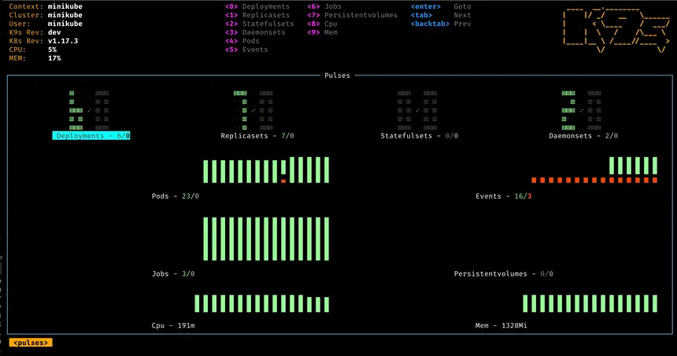

# k8s - Kubernetes

Kubernetes is a powerful tool, if used correctly! It allows for fast and scalable deployments, but not done right and it will eat away all your resources on your datacenters quickly. Understanding Kubernetes is essential for a scalable business to customers.

### File hierarchy

```markdown
$./
├── base/
│   ├── configmaps/
│   ├── deployments/
│   ├── manifests/
│   ├── namespaces/
│   ├── pvcs/
│   ├── roles/
│   ├── secrets/
│   ├── services/
│   └── hpas/  # instead of horizontalpodautoscalers
└── overlays/
    ├── dev/
    │   ├── kustomization.yaml
    │   └── config-map-dev.yaml
    └── prod/
        ├── kustomization.yaml
        ├── replica-patch.yaml
        └── resources-limits.yaml
```

### Assumed deployment steps

```bash
kubectl apply -f namespaces/monitoring.yaml
kubectl apply -f roles/prometheus-clusterPolicy.yaml
kubectl apply -f roles/prometheus-clusterRole.yaml
kubectl apply -f configmaps/prometheus-config.yaml
kubectl apply -f configmaps/grafana-datasource.yaml
kubectl apply -f services/prometheus-service.yaml
kubectl apply -f services/nginx-service.yaml
kubectl apply -f deployments/nginx.yaml
kubectl apply -f deployments/grafana.yaml
kubectl apply -f deployments/prometheus.yaml

```

---

### QoL with HELM and Rancher

> *https://ranchermanager.docs.rancher.com/getting-started/installation-and-upgrade/install-upgrade-on-a-kubernetes-cluster*

```bash
helm install rancher rancher-latest/rancher
helm upgrade rancher rancher-latest/rancher
```


### Better overview with k9scli

